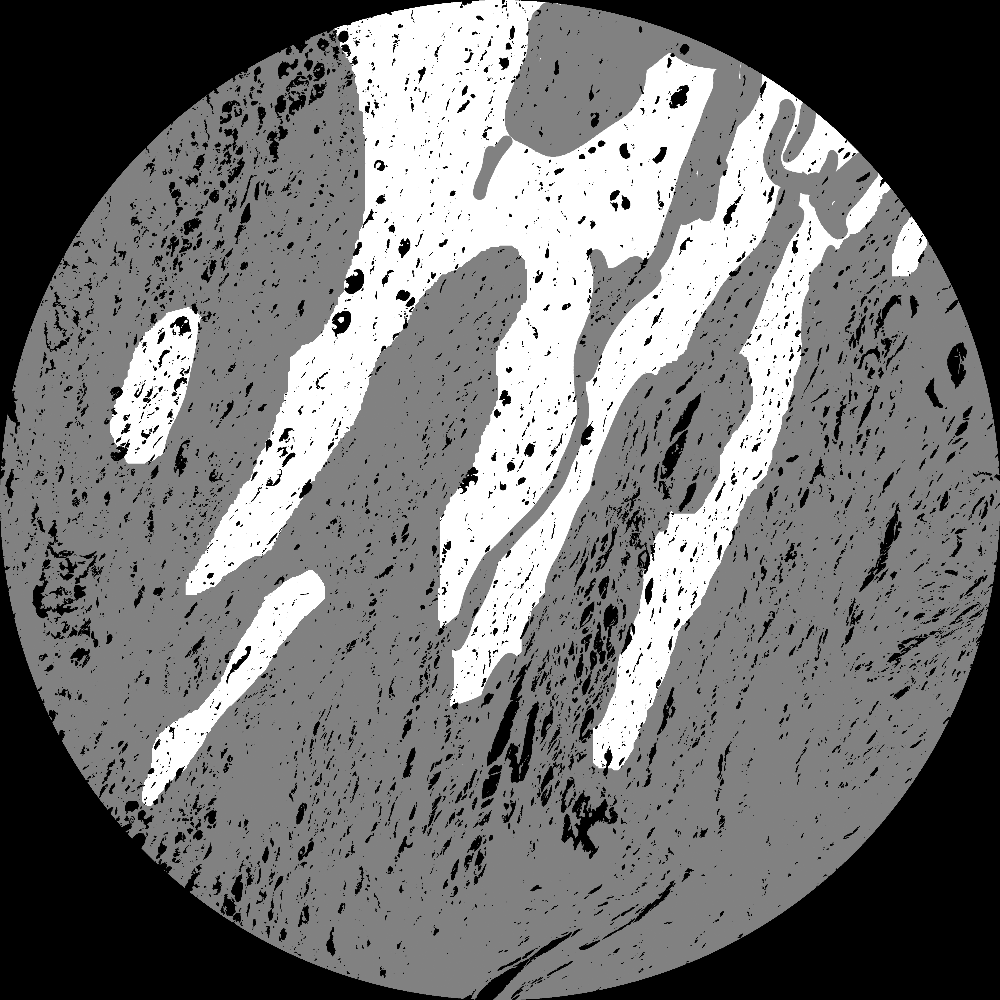
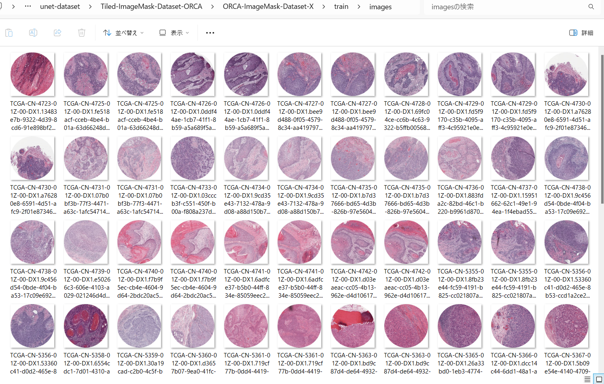
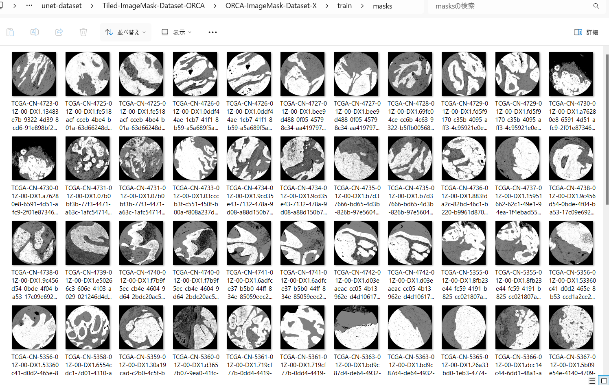
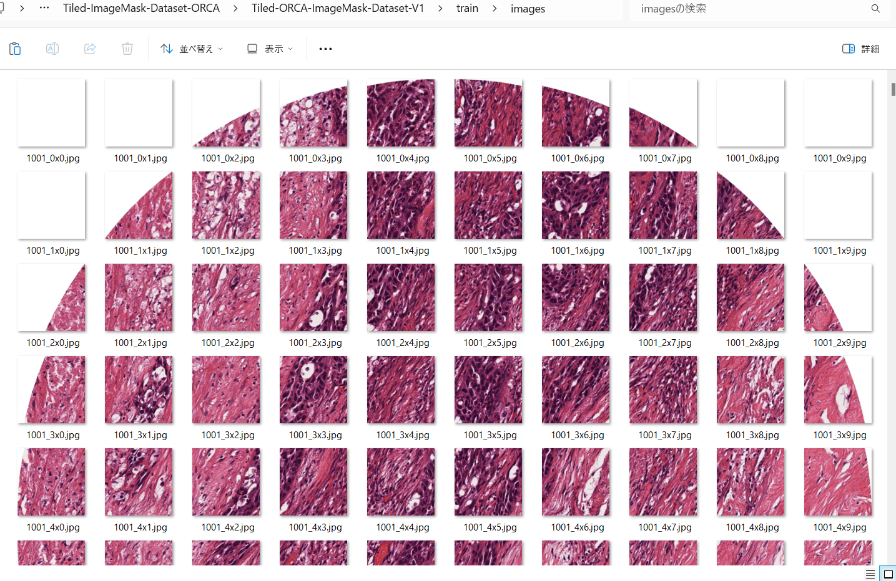
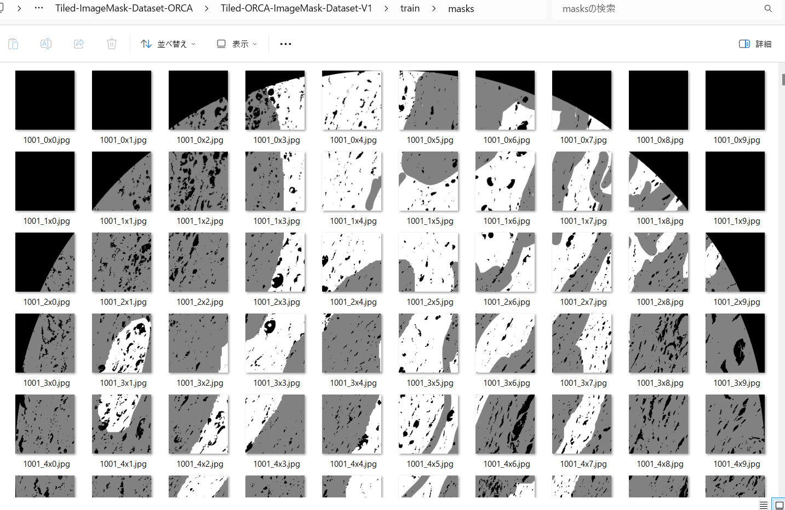
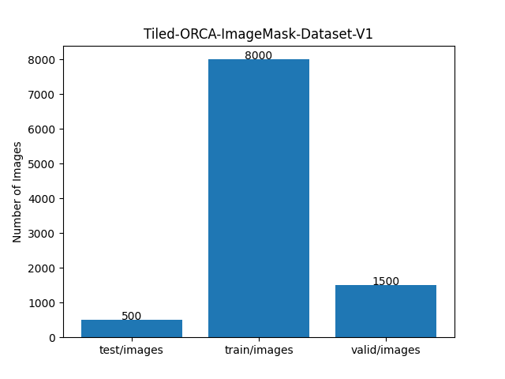

<h2>Tiled-ImageMask-Dataset-ORCA (2024/04/28)</h2>

This is a simple Tiledly-Splitted ImageMask Dataset for Oral Cancer Image Segmentation. 
The dataset used here has been taken from the following web-site 
<b>ORCA: ORal Cancer Annotated dataset</b> 
<pre>https://sites.google.com/unibas.it/orca/home</pre> 
We have generated test, train, and valid datasets of 512x512 pixel-size from the original ORCA,
because the pixel-size of all images and masks of the dataset is 4500x4500, and too large to 
use for training of an ordinary segmentation model.  
 

<table>
<tr>
<td>
<b>Oral cancer image sample </b> 

</td>
<td>
<b>Oral cancer mask sample </b> 

</td>
</tr>
</table>
 
<b>
You can download our 512x512 tiledly-splitted <b>Tiled-ORCA-ImageMask-Dataset</b> from the google drive
<a href="https://drive.google.com/file/d/1ILujbAFlycxGDieCR-TAi-Iu0afwKnNi/view?usp=sharing">
Tiled-ORCA-ImageMask-Dataset-V1.zip
</a>
</b>
 

<h3>1. Dataset Citation</h3>
<pre>
If you use the ORCA data, please cite:
F.  Martino,  D.D.  Bloisi,  A.  Pennisi,  M. Fawakherji,  G. Ilardi,  D. Russo,  D. Nardi,  S. Staibano, F. Merolla
"Deep Learning-based Pixel-wise Lesion Segmentation on Oral Squamous Cell Carcinoma Images"
Applied Sciences: 2020, 10(22), 8285; https://doi.org/10.3390/app10228285  [PDF]
</pre>
 

<h3>2. ImageMask Dataset Generation</h3>

If you would like to generate your own ImageMask-Dataset, please download the two original master datataset of  
<a href="https://drive.google.com/drive/folders/1XfplgYK5JWzzYWXQhrPUQujXNKUDK-WR">validation_100</a> 
and <a href="https://drive.google.com/drive/folders/1A_xiKTwBNO9XS_NzdDvWJNAx_z1nRnpS">test_100</a> in the following download page.  
<a href="https://sites.google.com/unibas.it/orca/download">Download</a>,
and place the downloaded files under valid and test repectively.  

Please run the following command for Python script <a href="./ImageMaskDatasetGenerator.py">ImageMaskDatasetGenerator.py</a>.
 
<pre>
> python ImageMaskDatasetGenerator.py
</pre>
This script splits *png and *_mask.png files in <b>valid</b> folder into images and masks folders under <b>./ORCA_master</b> as shown below.
 
<pre> 
./ORCA_master
├─images
│  ├─*.jpg
│  ├─*.jpg
│  └─,,,
└─masks
    ├─*.jpg
    ├─*.jpg
    └─...
</pre>

To create these new dataset <b>ORCA_master</b> with images and masks sub folders, all images and masks of the original dataset 
are resized to be 5120x5120 pixel-size from the original 4500x4500 pixel-size, and saved as jpg files. 

<h3>3. Split ORCA master</h3>

Please run the following command for Python <a href="./split_master.py">split_master.py</a> 
 
<pre>
>python split_master.py
</pre>
, by which test, train and valid subdatasets are created under <b>./ORCA-ImageMask-Dataset-X</b>. 
<pre>
./ORCA-ImageMask-Dataset-X
├─test
│  ├─images
│  └─masks
├─train
│  ├─images
│  └─masks
└─valid
    ├─images
    └─masks
</pre>

Train images sample 
  
Train mask sample 
  

<h3>4. Split ORCA-ImageMask-Dataset to tiles </h3>
Please run the following command for Python <a href="./ImageMaskTilesSplitter.py">ImageMaskTilesSplitter.py</a> 
 
<pre>
>python ImageMaskTilesSplitter.py
</pre>
, by which tiledly splitted  <b>./Tiled-ORCA-ImageMask-Dataset-V1</b>. 
<pre>
./Tiled-ORCA-ImageMask-Dataset-V1
├─test
│  ├─images
│  └─masks
├─train
│  ├─images
│  └─masks
└─valid
    ├─images
    └─masks
</pre>

<b>Tiled train/image sample</b> 
 
<b>Tiled train/mask sample</b> 

 

Dataset Statictics  

 

